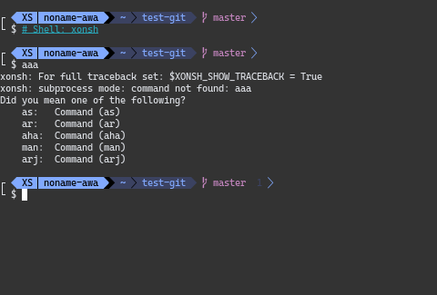

[中文文档](README_zh.md)

# This repository provides the gxy-theme for Bash, Fish, Nushell, Pwsh, Xonsh, and Zsh.

## Prerequisites:
- git
- nerd font

## Prompt Composition
- This theme uses a two-line prompt. The top line includes the shell name, username, path, git branch, and status code (Nushell also show shells info). The bottom line is for command input.
- This theme uses `` to separate the path segments. Zsh, Pwsh, Xonsh, and Fish will have simplified path displays.

## Installation and Configuration

### Bash
1. Copy the `bash-theme` `prompt_custom` function and the `PROMPT_COMMAND=prompt_custom` line to your `~/.bashrc`.
2. Run `source ~/.bashrc` or re-enter bash.

### Zsh
1. Install oh-my-zsh.
2. Copy the `zsh-theme` file to the `~/.oh-my-zsh/themes/` directory, renaming it to `gxy.zsh-theme`.
3. Edit your `~/.zshrc` file to set the theme: `ZSH_THEME="gxy"`
4. Run `source ~/.zshrc` or re-enter zsh.

### Fish
1. Copy the `fish-theme` `fish_prompt` function content to `~/.config/fish/functions/fish_prompt.fish`.
2. Reload the Fish configuration or re-enter Fish.

### Xonsh
1. Copy the `xonsh-theme` content to `~/.xonshrc`.
2. Reload the Xonsh configuration or re-enter Xonsh.

### PowerShell
1. Copy the `pwsh-theme` content to the Pwsh configuration file, typically `$PROFILE`.
2. Reload the Pwsh configuration or re-enter Pwsh.

### Nushell
1. Copy the `nu-theme` content to `~/.config/nushell/config.nu`.
2. Reload the Nushell configuration or re-enter Nushell.

## Example Screenshots

## Contributing
Contributions and suggestions are welcome! Feel free to contact me by submitting a PR or an Issue.

## License
This project is licensed under the MIT License. For more details, see the LICENSE file.
