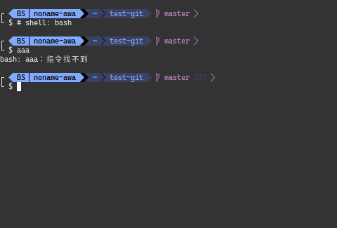
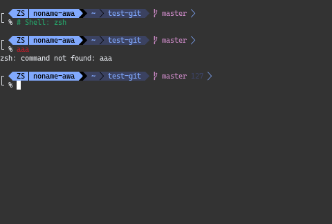
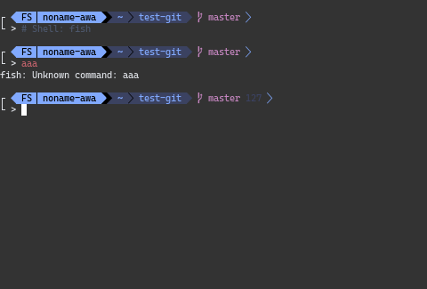
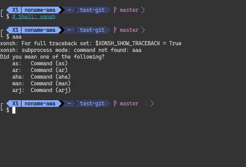
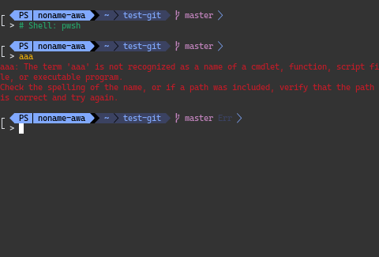
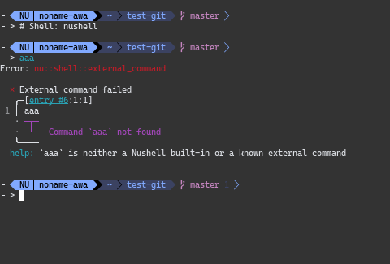

[English README](README.md)

# 本仓库提供 gxy-theme 主题，适用于 Bash、Fish、Nushell、Pwsh、Xonsh 和 Zsh。

## 使用前需要
- git
- nerd font

## 提示符组成
- 该主题为双行提示符，上方包括 shell 名称、用户名、路径、git 分支与状态码。（nushell 还会显示 shells 信息），下方为输入的命令。
- 该主题使用 `` 对路径进行分割，Zsh、Pwsh、Xonsh、Fish 会有简化路径显示。

## 安装与配置

### Bash
1. 将 `bash-theme` prompt_custom 函数与 `PROMPT_COMMAND=prompt_custom` 内容复制到 `~/.bashrc` 中。
2. 运行 `source ~/.bashrc` 或重新进入 bash。

### Zsh
1. 安装 oh-my-zsh。
2. 将 `zsh-theme` 文件复制到 `~/.oh-my-zsh/themes/` 目录下，文件名为 `gxy.zsh-theme`。
3. 编辑 `~/.zshrc` 文件，设置主题：`ZSH_THEME="gxy"`
4. 运行 `source ~/.zshrc` 或重新进入 zsh。

### Fish
1. 将 `fish-theme` 的 `fish_prompt` 函数内容复制到 `~/.config/fish/functions/fish_prompt.fish` 中。
2. 重新加载 fish 配置或重新进入 fish。

### Xonsh
1. 将 `xonsh-theme` 内容复制到 `~/.xonshrc` 中。
2. 重新加载 xonsh 配置或重新进入 xonsh。

### PowerShell
1. 将 `pwsh-theme` 内容复制到 Pwsh 配置文件中。一般为 `$PROFILE`。
2. 重新加载 Pwsh 配置或重新进入 Pwsh。

### Nushell
1. 将 `nu-theme` 内容复制到 `~/.config/nushell/config.nu` 中。
2. 重新加载 nushell 配置或重新进入 nushell。

## 示例截图

## 贡献
欢迎贡献代码和提出建议！您可以通过提交 PR 或 Issue 与我联系。

## 许可证
此项目基于MIT许可证，详情请参见 LICENSE 文件。
